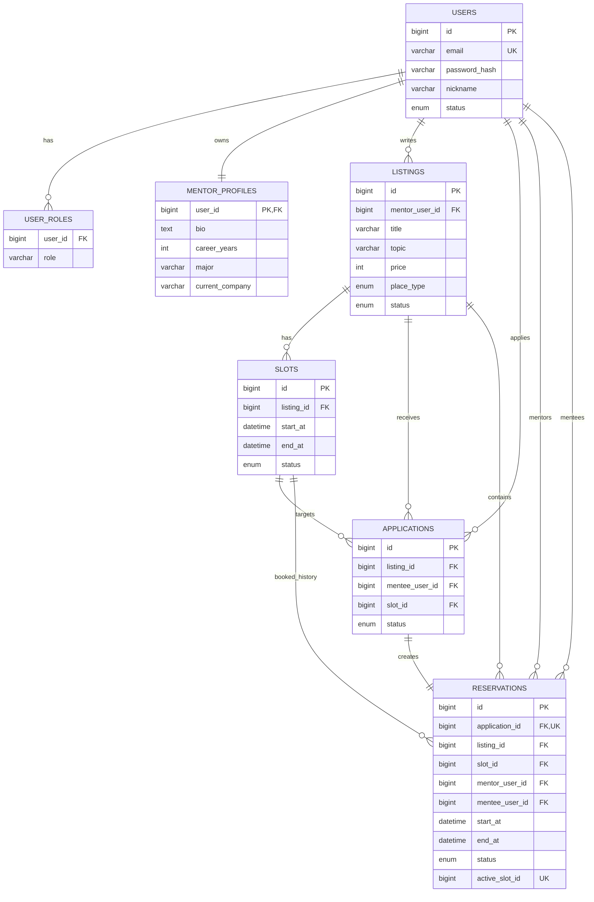

# Mentoring

멘토와 멘티를 연결하는 멘토링 플랫폼 백엔드 프로젝트다. 현재는 인증, 멘토링 글 관리, 신청, 예약 생성 및 상태 전이까지의 핵심 도메인 흐름을 구현하고 있다.

## 프로젝트 목표
- Spring Boot 기반 백엔드 구조 익히기
- JWT 인증/인가 흐름 이해하기
- 상태 전이 중심 도메인 설계 연습하기
- 테스트 코드로 핵심 비즈니스 규칙 검증하기

## 핵심 도메인 흐름
이 프로젝트는 아래 흐름을 중심으로 설계했다.

1. 멘토가 `Listing`을 생성한다.
2. 각 `Listing`은 여러 개의 `Slot`을 가진다.
3. 멘티는 특정 `Listing`의 특정 `Slot`에 대해 `Application`을 생성한다.
4. 멘토가 신청을 수락하면 `Reservation`이 생성된다.
5. 이후 예약은 별도의 상태 전이를 가진다.

핵심 규칙:
- 같은 멘티는 같은 슬롯에 `APPLIED` 상태 신청을 중복으로 생성할 수 없다.
- 슬롯이 해당 등록글에 속하지 않으면 신청할 수 없다.
- 활성 예약이 존재하는 슬롯에는 새 신청/수락을 진행할 수 없다.
- 신청 수락 시 예약이 생성되며, 예약 생성과 슬롯 점유는 같은 트랜잭션에서 처리한다.
- 활성 예약 상태(`PENDING_PAYMENT`, `CONFIRMED`)에서는 같은 슬롯에 중복 예약할 수 없다.
- 예약이 `CANCELED` 되면 슬롯은 다시 `OPEN`으로 돌아가며, 이후 새 예약 이력을 생성할 수 있다.

## 기술 스택
- Java 21
- Spring Boot 3.5.11
- Spring Web
- Spring Security
- Spring Data JPA
- Spring Validation
- MySQL
- Flyway
- Querydsl
- JJWT
- Swagger/OpenAPI
- JUnit 5
- Mockito
- Spring Security Test
- Testcontainers

## 현재 구현 범위
### 인증
- `POST /api/auth/register`
- `POST /api/auth/login`
- `POST /api/auth/refresh`
- JWT 기반 인증 필터 및 인증 실패 응답 처리

### Listing
- `POST /api/listings`
- `GET /api/listings/{id}`
- `GET /api/listings`
- `PATCH /api/listings/{id}`
- `PATCH /api/listings/{id}/status`
- Querydsl 기반 검색 / 정렬 / 페이징

### Application
- `POST /api/applications`
- `GET /api/applications/{id}`
- `GET /api/applications`
- `PATCH /api/applications/{id}/accept`
- `PATCH /api/applications/{id}/reject`

### Reservation
- 신청 수락 시 예약 생성
- `GET /api/reservations/{id}`
- `PATCH /api/reservations/{id}/status`
- `GET /api/reservations`
- 예약 상태 변경 응답에 현재 `slotStatus` 포함
- 예약은 “반복 수업”이 아니라 **1회성 멘토링 일정** 기준으로 설계

## 상태 전이
### ListingStatus
- `ACTIVE -> INACTIVE, DELETED`
- `INACTIVE -> ACTIVE, DELETED`
- `DELETED`는 종단 상태

### SlotStatus
- `OPEN -> BOOKED`
- `BOOKED -> OPEN`

### ApplicationStatus
- `APPLIED -> ACCEPTED, REJECTED, CANCELED`
- `ACCEPTED`, `REJECTED`, `CANCELED`는 종단 상태

### ReservationStatus
- `PENDING_PAYMENT -> CONFIRMED, CANCELED`
- `CONFIRMED -> COMPLETED, CANCELED`
- `CANCELED`, `COMPLETED`는 종단 상태

## 패키지 구조
```text
org.example.mentoring
├── application
├── auth
├── config
├── exception
├── listing
├── mentor
├── reservation
├── review
├── security
└── user
```

구조 기준:
- 기능 중심 패키지 분리
- 공통 설정은 `config`
- 인증/인가 관련 구현은 `security`
- 도메인별 DTO / service / controller / repository 분리

## ERD


설계 포인트:
- `Application -> Reservation`은 1:1 흐름이다.
- 예약 생성 시 `Slot`은 `BOOKED`로 전이되고, 예약 취소 시 다시 `OPEN`으로 돌아간다.
- `reservations.active_slot_id UNIQUE`로 활성 예약 상태에서만 같은 슬롯 중복 예약을 막는다.
- 서비스에서는 `existsBySlotIdAndStatusIn(...)`와 슬롯 락으로 먼저 검증하고, DB는 최종 무결성을 보장한다.
- `Reservation`은 `start_at`, `end_at`을 별도로 저장해 슬롯 변경/삭제 이후에도 예약 시각 이력을 보존한다.

## 트러블슈팅 요약
- 예약 취소 후 슬롯 재사용 정책을 적용하는 과정에서 기존 `reservations.slot_id UNIQUE` 제약이 취소 이력까지 막아 같은 슬롯 재예약을 불가능하게 만드는 문제를 확인했다.
- 이를 해결하기 위해 `slot_id` 절대 unique를 제거하고, 활성 예약 상태(`PENDING_PAYMENT`, `CONFIRMED`)에서만 값이 생기는 `active_slot_id` generated column + unique 제약으로 변경했다.
- 서비스 레벨에서는 `existsBySlotIdAndStatusIn(...)`와 슬롯 비관적 락으로 사전 검증하고, DB는 `active_slot_id` unique 제약으로 최종 정합성을 보장하도록 역할을 분리했다.

## 예약 조회 정책
- 현재 `Reservation`은 반복 수업 패키지가 아니라 **시간/장소가 확정된 1회성 멘토링 일정**으로 본다.
- 예약 목록 탭은 아래 관점으로 조회한다.
  - `view=MENTOR`: 내가 멘토로 참여한 일정
  - `view=MENTEE`: 내가 멘티로 참여한 일정
- 메인 필터 기준은 아래 세 가지로 둔다.
  - `PENDING`: 결제/확정 대기 중인 일정(`PENDING_PAYMENT`)
  - `UPCOMING`: 진행 예정인 일정(`CONFIRMED`)
  - `COMPLETED`: 완료된 수업(`COMPLETED`)
- `CANCELED`는 메인 탭에 섞지 않고, 별도 탭/필터 후보로 분리한다.
- 기본 정렬 기준은 아래 두 가지를 우선으로 본다.
  - `SOONEST`: `startAt ASC`
  - `LATEST`: `createdAt DESC`

## 데이터베이스 마이그레이션
Flyway로 스키마를 버전 관리한다.

현재 반영된 주요 마이그레이션:
- `V1__init_users.sql`
- `V2__create_user_roles.sql`
- `V3__create_mentor_profiles.sql`
- `V4__create_listings.sql`
- `V5__create_availability_slots.sql`
- `V6__rename_availability_slots_to_slots.sql`
- `V7__create_applications.sql`
- `V8__create_reservations.sql`
- `V9__add_active_slot_unique_constraint.sql`

현재 기준 핵심 테이블:
- `users`
- `user_roles`
- `mentor_profiles`
- `listings`
- `slots`
- `applications`
- `reservations`


## 예시 요청 / 응답
### 회원가입
요청:
```http
POST /api/auth/register
Content-Type: application/json
```

```json
{
  "email": "mentee@example.com",
  "password": "test1234!"
}
```

응답:
```json
{
  "email": "mentee@example.com",
  "userStatus": "ACTIVE"
}
```

### 로그인
요청:
```http
POST /api/auth/login
Content-Type: application/json
```

```json
{
  "email": "mentee@example.com",
  "password": "test1234!"
}
```

응답:
```json
{
  "accessToken": "<ACCESS_TOKEN>",
  "refreshToken": "<REFRESH_TOKEN>"
}
```

### 등록글 생성
요청:
```http
POST /api/listings
Authorization: Bearer <ACCESS_TOKEN>
Content-Type: application/json
```

```json
{
  "title": "Spring Security 멘토링",
  "topic": "Spring Security",
  "price": 50000,
  "placeType": "ONLINE",
  "placeDesc": null,
  "description": "JWT 인증 흐름을 같이 점검합니다."
}
```

응답:
```json
{
  "id": 1,
  "title": "Spring Security 멘토링",
  "topic": "Spring Security",
  "price": 50000,
  "placeType": "ONLINE",
  "description": "JWT 인증 흐름을 같이 점검합니다.",
  "placeDesc": null,
  "status": "ACTIVE"
}
```

### 신청 생성
요청:
```http
POST /api/applications
Authorization: Bearer <ACCESS_TOKEN>
Content-Type: application/json
```

```json
{
  "listingId": 1,
  "slotId": 3,
  "message": "포트폴리오 코드 리뷰를 받고 싶습니다."
}
```

응답:
```json
{
  "id": 10,
  "status": "APPLIED",
  "message": "포트폴리오 코드 리뷰를 받고 싶습니다."
}
```

### 신청 수락
요청:
```http
PATCH /api/applications/10/accept
Authorization: Bearer <ACCESS_TOKEN>
```

응답:
```json
{
  "id": 10,
  "status": "ACCEPTED"
}
```

### 예약 상태 변경
요청:
```http
PATCH /api/reservations/20/status
Authorization: Bearer <ACCESS_TOKEN>
Content-Type: application/json
```

```json
{
  "status": "CONFIRMED"
}
```

응답:
```json
{
  "reservationId": 20,
  "reservationStatus": "CONFIRMED",
  "startAt": "2026-03-20T10:00:00",
  "endAt": "2026-03-20T11:00:00",
  "listingId": 1,
  "listingTitle": "Spring Security 멘토링",
  "partnerUserId": 2,
  "partnerNickname": "멘티닉네임",
  "slotStatus": "BOOKED"
}
```

## 테스트
현재는 컨트롤러 테스트와 서비스 테스트를 중심으로 핵심 규칙을 검증한다.

검증 대상:
- 성공 흐름
- 권한 실패
- 상태 전이 실패
- 중복 신청 실패
- 슬롯 정합성 실패

실행 예시:
```bash
./gradlew --no-daemon test
```

서비스 테스트:
```bash
./gradlew --no-daemon test \
  --tests org.example.mentoring.application.service.ApplicationServiceTest \
  --tests org.example.mentoring.reservation.service.ReservationServiceTest
```

컨트롤러 테스트:
```bash
./gradlew --no-daemon test \
  --tests org.example.mentoring.application.controller.ApplicationControllerTest \
  --tests org.example.mentoring.reservation.controller.ReservationControllerTest
```

## 실행 방법
### 1. 환경 변수 준비
루트의 `.env` 또는 로컬 설정 파일을 사용한다.

템플릿:
- `src/main/resources/application-local.example.yml`

### 2. 인프라 실행
```bash
docker compose up -d
```

### 3. 애플리케이션 실행
```bash
./gradlew bootRun
```

## API 문서
Swagger/OpenAPI 의존성은 추가되어 있다.

현재는 문서화 환경만 구성된 상태이며, `@Operation`, `@ApiResponse`, `@Schema` 등 상세 문서 어노테이션은 추후 보강할 예정이다.

예상 경로:
- `/swagger-ui/index.html`

## 다음 작업
- Reservation 통합 테스트 보강
  - 동일 슬롯 동시 수락 경쟁 상황
  - 필요 시 `flush/clear` 기반 DB 재조회 검증 강화
- 결제 및 취소 정책 구체화
- 리뷰 도메인 구현
- 채팅은 Reservation 기반 1:1 REST 메시지 기능부터 구현하고, 실시간 WebSocket/STOMP는 후속 확장으로 분리

## 통합 테스트 진행 상태
- `Application ACCEPTED -> Reservation 생성 -> Slot BOOKED` 검증 완료
- 예약 취소 시 `Reservation CANCELED -> Slot OPEN` 검증 완료
- 취소 후 같은 슬롯 재예약 가능 검증 완료
- 활성 예약이 있는 동일 슬롯 중복 예약 실패 검증 완료
