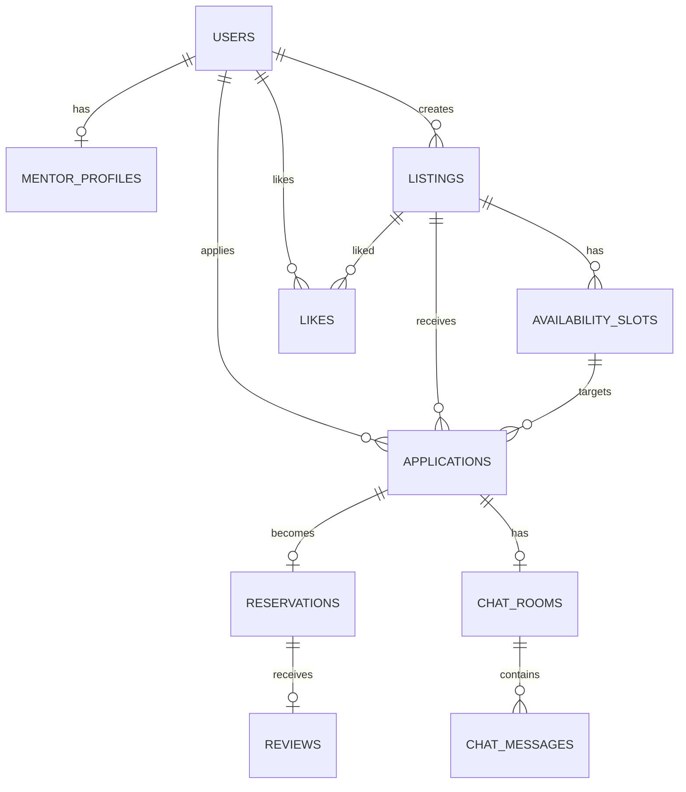

# 멘토-멘티 매칭 서비스 설계도 (MVP v1)
> 목표: **2026-04-30까지 기능 구현 완료**  
> 원칙: **비동기/큐/복잡한 외부 의존성 없이**, 동기 트랜잭션·락·인덱스·상태전이로 “내부 동작 이해” 중심으로 구현

---

## 진행 스냅샷 (2026-03-01)
- 완료
  - JWT 기반 인증/인가 기본 골격
  - 공통 에러코드/예외 핸들러
  - Auth API(`register/login/refresh`)
  - `user_roles` 마이그레이션(Flyway V2)
  - AuthController 웹 레이어 테스트 통과
- 보류
  - logout(리프레시 토큰 무효화)은 Redis 도입 시점에 구현
- 다음 우선순위
  - listing/reservation 도메인 구현 착수
  - 상태전이/권한 검증 통합 테스트 확대

## 진행 스냅샷 (2026-03-04)
- 완료
  - Listing API 3종 기본 구현
    - `GET /api/listings` (페이지/정렬)
    - `GET /api/listings/{id}` (상세)
    - `PATCH /api/listings/{id}` (부분 수정)
  - Listing 수정 권한 검증 로직 반영
    - 작성자(`mentor_user_id`)와 로그인 사용자 ID 비교
  - `ListingController` 웹 레이어 테스트 추가/통과
    - 목록 조회 성공
    - 상세 조회 성공
    - 수정 성공
    - 수정 권한 실패(403)
- 다음 우선순위
  - Listing 검색 필터(topic/placeType/price range) 실제 쿼리 적용
  - Listing 생성 API(`POST /api/listings`) 구현
  - 상태 변경 API 분리(`PATCH /api/listings/{id}/status`)

## 진행 스냅샷 (2026-03-06)
- 완료
  - Querydsl 기반 Listing 검색 반영
    - topic/placeType/price range 동적 where
    - pageable sort -> querydsl orderBy 연결
  - Listing 생성 API 구현
    - `POST /api/listings` + `201 Created`
    - `OFFLINE`일 때 `placeDesc` 필수 규칙 적용
  - Listing 상태 변경 API 구현
    - `PATCH /api/listings/{id}/status`
    - `ListingStatus` 전이 규칙 엔티티 캡슐화(`setStatus`)
    - 전이 실패 시 `LISTING_INVALID_STATUS_TRANSITION`
  - Listing 컨트롤러 테스트 보강 및 통과
    - 생성/목록/상세/수정/상태변경 케이스
- 현재 집중 구간
  - Application/Reservation 상태전이 구현 전, Listing 도메인 안정화 마무리
  - PR 기반 개발 플로우로 전환(직접 main push 중단)
- 다음 우선순위
  - `Application -> Reservation` 흐름 구현 시작
  - 상태전이/권한 검증을 서비스 단위 테스트로 확대

## 리뷰 반영 계획 (2026-03-07)
- 핵심 우선순위 조정
  - Listing 추가 기능 확장보다 `Application -> Reservation` 본체 구현을 우선한다.
  - 목표: 활성 예약 기준 슬롯 중복 예약 방지(`active_slot_id UNIQUE`) + 상태 전이 + 권한 검증을 먼저 완성
- 기술 부채 정리(병행)
  - JWT 설정을 `@ConfigurationProperties` 기반으로 단일화(설정 키/만료시간 하드코딩 제거)
  - 엔티티 `@Data` 사용 제거, `@Getter` 중심 + 도메인 메서드만 노출
- 테스트 전략 조정
  - `@WebMvcTest` 유지 + 서비스 단위 테스트 추가 + 핵심 플로우 통합 테스트 1세트
  - 우선 검증: 신청 수락 시 예약 생성, 중복 슬롯 예약 실패, 상태 전이 실패 케이스
- 문서/포장 보강
  - README에 ERD/상태전이 표/핵심 트랜잭션/실행 방법/테스트 전략 추가
  - Flyway 마이그레이션 흐름이 리포에서 바로 보이도록 정리

## 진행 스냅샷 (2026-03-16)
- 완료
  - `Application ACCEPTED -> Reservation 생성 -> Slot BOOKED` 흐름 정리
  - 예약 취소 시 슬롯 `OPEN` 복귀 정책 반영
  - `Slot.book()` / `Slot.reopen()` 도입
  - 슬롯 비관적 락(`findByIdForUpdate`) 적용
  - 활성 예약 기준 중복 방지
    - 서비스: `existsBySlotIdAndStatusIn(...)`
    - DB: `active_slot_id` generated column + unique 제약
  - JWT 설정을 `JwtProperties` 기반으로 단일화
  - README / 트러블슈팅 문서 반영
- 다음 우선순위
  - Reservation 조회 API 설계/구현
  - 통합 테스트 확대
  - 취소 정책/조회 정책 세부화

---

## 1. 제품 개요

### 1.1 한 줄 설명
멘토가 **주제/스펙/가능 시간(슬롯)/장소(온라인/오프라인)**를 등록하면, 멘티가 **시간 슬롯을 선택해 신청**하고, **입금확인(서비스 내 결제 미구현)**을 통해 예약을 확정한 뒤 **후기/평점**을 남기는 서비스.
현재 `Reservation`은 **반복 수업 패키지**가 아니라 **한 번의 멘토링 만남이 확정된 1회성 일정**으로 본다.

### 1.2 핵심 유저 플로우
- **멘토**
  1) (선택) 멘토 프로필 작성 → 2) 등록글(Listing) 생성 → 3) 가능 시간 슬롯 등록  
  4) 멘티 신청(Application) 수락/거절 → 5) 입금 확인 → 6) 예약 진행/완료 처리 → 7) 후기 확인
- **멘티**
  1) 가입/로그인 → 2) 등록글 탐색(정렬/필터) → 3) 시간 슬롯 선택 → 4) 신청  
  5) 입금 완료 표시(선택: 증빙 업로드) → 6) 예약 확정 → 7) 진행 → 8) 후기 작성

### 1.3 결제 미구현 운영 방식 (추천)
- 서비스 내 결제 대신, **예약 상태로만 관리**
  - 멘티: `입금 완료` 버튼(선택: 증빙 이미지 업로드)
  - 멘토: `입금 확인` 버튼 → 예약 `CONFIRMED`

---

## 2. 범위(Scope)

### 2.1 이번 MVP In-scope
- 인증/인가: **JWT(Access/Refresh)** 기반 로그인
- 멘토 기능: 프로필(선택), 등록글(Listing), 가능 시간 슬롯(Slot)
- 멘티 기능: 탐색/검색/정렬, 찜(Like), 신청(Application)
- 예약/상태: 신청 수락, 입금 확인, 확정/취소/완료
- 후기/평점: 완료된 예약에만 작성, 정렬(평점순/후기순)
- 채팅: **Reservation 기반 1:1 메시지 기능 (REST 저장/조회 중심)**

### 2.2 이번 MVP Out-of-scope(나중에)
- OAuth(카카오/구글) 로그인
- 서비스 내 결제(PG), 에스크로/환불 정책 자동화
- 추천 알고리즘, 고급 검색(ES), 알림 푸시
- 관리자 콘솔 고도화(신고 처리 워크플로우)

---

## 3. 중요한 설계 결정(현재 확정)

1) **장소: ONLINE/OFFLINE 둘 다 지원**  
2) **가능 시간 슬롯: 멘토가 직접 입력(단건 등록)**  
3) **매칭 단위: Slot 단위(시간을 찍고 신청)**  
   - 장점: 예약 충돌 방지가 쉬움(유니크 제약/락), 내부 동작이 명확

---

## 4. 도메인 모델 & 상태(State Machine)

### 4.1 역할(Role)
- `USER` 기본
- 멘토/멘티는 **둘 다 가능**(한 계정이 멘토/멘티 겸업 가능)
  - `mentor_profiles` 존재 여부로 멘토 기능 활성화(권장)
  - 또는 users.role에 `MENTOR|MENTEE|BOTH` (선호에 따라 택1)

### 4.2 상태 정의
#### Slot 상태(AvailabilitySlot.status)
- `OPEN`: 신청 가능
- `BOOKED`: 활성 예약이 슬롯을 점유 중인 상태
- 전이 규칙
  - `OPEN -> BOOKED`: 신청 수락 후 예약 생성 시
  - `BOOKED -> OPEN`: 예약 취소 시

#### Application 상태
- `APPLIED`: 멘티가 신청 제출
- `ACCEPTED`: 멘토가 수락 → 예약 생성(입금대기)
- `REJECTED`: 멘토가 거절
- `CANCELED`: 멘티가 취소(수락 전/후 정책 명확히)

#### Reservation 상태(핵심)
- `PENDING_PAYMENT`: 입금 대기(수락 직후)
- `CONFIRMED`: 멘토가 입금 확인 → 예약 확정
- `CANCELED`: 취소(정책: 누가/언제 취소 가능)
- `COMPLETED`: 진행 완료(시간 경과 + 멘토 확인 등)
> `REVIEWED`는 굳이 상태로 두지 않고 `reviews` 존재 여부로 판단 추천
> 활성 예약으로 보는 상태는 `PENDING_PAYMENT`, `CONFIRMED` 두 가지다.

---

## 5. ERD (MySQL 기준)

### 5.1 Mermaid ERD (초안)

---

## 5.2 테이블 설계(컬럼/제약/인덱스)

> 타입 예시는 MySQL 8 기준. 실제 구현 시 JPA 엔티티와 함께 조정.

### 5.2.1 users
| 컬럼 | 타입 | 제약 | 설명 |
|---|---|---|---|
| id | BIGINT | PK | |
| email | VARCHAR(255) | UNIQUE NOT NULL | 로그인 ID (이메일) |
| password_hash | VARCHAR(255) | NOT NULL | bcrypt 등 |
| nickname | VARCHAR(50) | NOT NULL | 표시명 |
| phone | VARCHAR(30) | NULL | 선택(나중에) |
| status | ENUM('ACTIVE','SUSPENDED','DELETED') | NOT NULL | 계정 상태 |
| created_at | DATETIME | NOT NULL | |
| updated_at | DATETIME | NOT NULL | |

**인덱스**
- `UK_users_email(email)`

---

### 5.2.2 mentor_profiles
| 컬럼 | 타입 | 제약 | 설명 |
|---|---|---|---|
| user_id | BIGINT | PK, FK(users.id) | 멘토 프로필은 유저 1:1 |
| bio | TEXT | NULL | 소개 |
| career_years | INT | NULL | 검색용 경력(년수) |
| major | VARCHAR(100) | NULL | 검색용 전공 |
| current_company | VARCHAR(120) | NULL | 검색용 현재 회사 |
| specs_json | JSON | NULL | 자유 확장 정보(자격증/포트폴리오 링크/수상이력 등) |
| base_location | VARCHAR(255) | NULL | 오프라인 기준 지역(예: 성수/홍대) |
| verified_flag | BOOLEAN | NOT NULL DEFAULT 0 | 검증 배지(나중에) |
| created_at | DATETIME | NOT NULL | |
| updated_at | DATETIME | NOT NULL | |

**인덱스(추천)**
- `IDX_mentor_profiles_career_years(career_years)`
- `IDX_mentor_profiles_major(major)`
- `IDX_mentor_profiles_current_company(current_company)`

---

### 5.2.3 listings (멘토 등록글)
| 컬럼 | 타입 | 제약 | 설명 |
|---|---|---|---|
| id | BIGINT | PK | |
| mentor_user_id | BIGINT | FK(users.id), NOT NULL | 작성자 |
| title | VARCHAR(120) | NOT NULL | 제목 |
| topic | VARCHAR(80) | NOT NULL | 예: Java/Spring/면접 |
| price | INT | NOT NULL | 원 단위(0 허용 가능) |
| place_type | ENUM('ONLINE','OFFLINE','BOTH') | NOT NULL | 장소 타입 |
| place_desc | VARCHAR(255) | NULL | 오프라인 상세/온라인 툴 |
| description | TEXT | NOT NULL | 상세 소개 |
| status | ENUM('ACTIVE','INACTIVE','DELETED') | NOT NULL | 노출 여부 |
| avg_rating | DECIMAL(3,2) | NOT NULL DEFAULT 0.00 | 정렬용 캐시 |
| review_count | INT | NOT NULL DEFAULT 0 | 정렬용 캐시 |
| created_at | DATETIME | NOT NULL | |
| updated_at | DATETIME | NOT NULL | |

**인덱스(추천)**
- `IDX_listings_topic(topic)`
- `IDX_listings_status_created(status, created_at)`
- 정렬 최적화:
  - `IDX_listings_status_rating(status, avg_rating, review_count)`
  - `IDX_listings_status_reviewcount(status, review_count, avg_rating)`

---

### 5.2.4 availability_slots (가능 시간)
| 컬럼 | 타입 | 제약 | 설명 |
|---|---|---|---|
| id | BIGINT | PK | |
| listing_id | BIGINT | FK(listings.id), NOT NULL | 어떤 등록글의 시간인지 |
| start_at | DATETIME | NOT NULL | 시작 |
| end_at | DATETIME | NOT NULL | 종료 |
| status | ENUM('OPEN','BOOKED') | NOT NULL | 슬롯 상태 |
| created_at | DATETIME | NOT NULL | |
| updated_at | DATETIME | NOT NULL | |

**제약/검증**
- `end_at > start_at`
- (가능하면) 같은 listing에서 시간 겹침 방지: 애플리케이션 레벨에서 검사(단, 완전한 DB 레벨 겹침 제약은 MySQL에서 복잡)

**인덱스**
- `IDX_slots_listing_status_start(listing_id, status, start_at)`
- (전체 탐색용) `IDX_slots_status_start(status, start_at)`

---

### 5.2.5 applications (멘티 신청)
| 컬럼 | 타입 | 제약 | 설명 |
|---|---|---|---|
| id | BIGINT | PK | |
| listing_id | BIGINT | FK(listings.id), NOT NULL | |
| slot_id | BIGINT | FK(availability_slots.id), NOT NULL | Slot 단위 매칭 |
| mentee_user_id | BIGINT | FK(users.id), NOT NULL | |
| message | TEXT | NULL | 신청 메시지 |
| status | ENUM('APPLIED','ACCEPTED','REJECTED','CANCELED') | NOT NULL | |
| created_at | DATETIME | NOT NULL | |
| updated_at | DATETIME | NOT NULL | |

**중복 신청 방지(추천)**
- DB 절대 unique보다는 서비스 정책으로 `APPLIED` 상태만 중복 신청 불가로 관리
  → 같은 멘티가 같은 슬롯에 처리되지 않은 신청(`APPLIED`)을 중복 생성할 수 없음
  → `REJECTED`, `CANCELED` 이후 재신청은 허용

**인덱스**
- `IDX_apps_listing_status(listing_id, status, created_at)`
- `IDX_apps_mentee_status(mentee_user_id, status, created_at)`

---

### 5.2.6 reservations (예약)
| 컬럼 | 타입 | 제약 | 설명 |
|---|---|---|---|
| id | BIGINT | PK | |
| application_id | BIGINT | FK(applications.id), UNIQUE NOT NULL | 신청 1건당 예약 0..1 |
| listing_id | BIGINT | FK(listings.id), NOT NULL | 중복 저장(조회 최적화) |
| slot_id | BIGINT | FK(availability_slots.id), NOT NULL | 슬롯 참조 |
| mentor_user_id | BIGINT | FK(users.id), NOT NULL | |
| mentee_user_id | BIGINT | FK(users.id), NOT NULL | |
| start_at | DATETIME | NOT NULL | 슬롯에서 복사(이력 보호) |
| end_at | DATETIME | NOT NULL | |
| status | ENUM('PENDING_PAYMENT','CONFIRMED','CANCELED','COMPLETED') | NOT NULL | |
| active_slot_id | BIGINT | GENERATED + UNIQUE | 활성 예약 상태일 때만 slot_id 반영 |
| mentee_paid_marked_at | DATETIME | NULL | 멘티가 “입금완료” 표시 |
| mentor_paid_confirmed_at | DATETIME | NULL | 멘토가 “입금확인” |
| canceled_reason | VARCHAR(255) | NULL | 취소 사유 |
| created_at | DATETIME | NOT NULL | |
| updated_at | DATETIME | NOT NULL | |

**제약/인덱스**
- `UNIQUE(application_id)`
- `UNIQUE(active_slot_id)`
  - `status IN ('PENDING_PAYMENT', 'CONFIRMED')`일 때만 값이 채워지도록 generated column 사용
- `IDX_resv_mentor_status_start(mentor_user_id, status, start_at)`
- `IDX_resv_mentee_status_start(mentee_user_id, status, start_at)`

---

### 5.2.7 reviews (후기)
| 컬럼 | 타입 | 제약 | 설명 |
|---|---|---|---|
| id | BIGINT | PK | |
| reservation_id | BIGINT | FK(reservations.id), UNIQUE NOT NULL | 예약당 1개 후기 |
| listing_id | BIGINT | FK(listings.id), NOT NULL | 집계용 |
| reviewer_user_id | BIGINT | FK(users.id), NOT NULL | 보통 멘티 |
| rating | TINYINT | NOT NULL | 1~5 |
| content | TEXT | NULL | |
| created_at | DATETIME | NOT NULL | |

**리뷰 작성 규칙**
- reservation.status == `COMPLETED` 인 경우만 허용

**Listing 캐시 갱신**
- 리뷰 생성 트랜잭션에서:
  - `review_count += 1`
  - `avg_rating = (avg_rating*(review_count-1) + rating) / review_count`
  - 또는 listing_id 기준 `AVG()` 재계산(데이터 적을 땐 단순, 커지면 증분 갱신 추천)

---

### 5.2.8 likes (찜/좋아요)
| 컬럼 | 타입 | 제약 | 설명 |
|---|---|---|---|
| id | BIGINT | PK | |
| user_id | BIGINT | FK(users.id), NOT NULL | |
| listing_id | BIGINT | FK(listings.id), NOT NULL | |
| created_at | DATETIME | NOT NULL | |

**제약**
- `UNIQUE(user_id, listing_id)` (토글 구현 쉬움)

---

### 5.2.9 chat_rooms / chat_messages (채팅)
#### chat_rooms
| 컬럼 | 타입 | 제약 | 설명 |
|---|---|---|---|
| id | BIGINT | PK | |
| application_id | BIGINT | FK(applications.id), UNIQUE NOT NULL | 신청 단위로 방 1개 |
| mentor_user_id | BIGINT | FK(users.id), NOT NULL | |
| mentee_user_id | BIGINT | FK(users.id), NOT NULL | |
| created_at | DATETIME | NOT NULL | |

#### chat_messages
| 컬럼 | 타입 | 제약 | 설명 |
|---|---|---|---|
| id | BIGINT | PK | |
| room_id | BIGINT | FK(chat_rooms.id), NOT NULL | |
| sender_user_id | BIGINT | FK(users.id), NOT NULL | |
| content | TEXT | NOT NULL | |
| created_at | DATETIME | NOT NULL | |
| read_at | DATETIME | NULL | 읽음 처리(나중에) |

**인덱스**
- `IDX_msg_room_created(room_id, created_at)`
- `IDX_msg_sender_created(sender_user_id, created_at)`

---

## 6. 트랜잭션/동시성 설계 (부하/내부동작 이해 포인트)

### 6.1 슬롯 예약 충돌 방지(가장 중요)
**목표:** 같은 slot_id로 2개 예약 확정이 절대 불가능해야 함.

#### 추천 구현(단순/강력)
- 서비스 레벨에서 `existsBySlotIdAndStatusIn(PENDING_PAYMENT, CONFIRMED)`로 활성 예약 존재 여부를 먼저 검사
- `SELECT slot FOR UPDATE`(`findByIdForUpdate`)로 슬롯 비관적 락 획득
- DB는 `active_slot_id UNIQUE` 로 활성 예약 상태에서만 최종 무결성 보장
- 예약 생성 로직에서:
  1) 신청 수락 시 트랜잭션 시작
  2) `SELECT slot FOR UPDATE`
  3) 활성 예약 존재 여부 확인
  4) slot.status = BOOKED 업데이트
  5) reservations insert
  6) 커밋

**중복 예약 시도 처리**
- 서비스 사전 체크: 도메인 예외(`이미 예약된 슬롯입니다`) 반환
- 최종 DB 충돌: `active_slot_id UNIQUE` 위반을 동일 도메인 예외로 매핑

### 6.2 상태 전이 검증(서버가 규칙을 강제)
- `PENDING_PAYMENT → CONFIRMED` : 멘토만 가능
- `CONFIRMED → COMPLETED` : (정책) 시간 지나면 멘토 확인, 혹은 수동
- `* → CANCELED` : 권한/시간 제한 정책 필요(예: 시작 24시간 전까지만 멘티 취소 가능)

> “상태 전이”는 Service 레이어에서 **현재 상태를 확인하고 다음 상태만 허용**.

---

## 7. API 설계 (REST 중심)

> 아래는 PRD/구현 스펙용 “요청/응답 구조” 수준.  
> 실제 DTO/에러코드는 구현하면서 맞추면 됨.

### 7.1 인증
- `POST /api/auth/register`
- `POST /api/auth/login` → access/refresh 발급
- `POST /api/auth/refresh`
- `POST /api/auth/logout` (리프레시 토큰 무효화 방식이면)

### 7.2 멘토 프로필/등록글/슬롯
- `POST /api/mentors/me/profile`
- `GET /api/mentors/{mentorUserId}/profile`

- `POST /api/listings` (멘토)
- `PATCH /api/listings/{listingId}` (멘토)
- `GET /api/listings/{listingId}`
- `GET /api/listings?topic=&placeType=&minPrice=&maxPrice=&sort=RATING|REVIEWS|LATEST&page=`

- `POST /api/listings/{listingId}/slots`
- `GET /api/listings/{listingId}/slots?from=&to=`
- `PATCH /api/slots/{slotId}` (필요 시 OPEN/BOOKED 외 정책 재정의 후 반영)

### 7.3 찜/좋아요
- `POST /api/listings/{listingId}/like` (토글)
- `GET /api/users/me/likes`

### 7.4 신청/예약
- `POST /api/applications`
  - body: listingId, slotId, message
- `GET /api/applications/{applicationId}`
  - 신청 당사자(멘토/멘티)만 상세 조회 가능
  - 반환: 신청 상태, 메시지, 상대방 정보, listing 기본 정보, 장소 정보, slot 시간
- `GET /api/applications?view=MENTOR|MENTEE&page=&size=&sort=LATEST|OLDEST&filter=PENDING|PROCESSED`
  - `view=MENTOR`: 내 listing에 들어온 신청
  - `view=MENTEE`: 내가 넣은 신청
  - `PENDING`: 처리 전 신청(`APPLIED`)
  - `PROCESSED`: 처리 완료 신청(`ACCEPTED`, `REJECTED`, `CANCELED`)
  - 정렬
    - `LATEST`: `created_at DESC`
    - `OLDEST`: `created_at ASC`

- `POST /api/applications/{applicationId}/accept` (멘토)
  - 결과: reservation 생성(status=PENDING_PAYMENT) + chat room 생성
- `POST /api/applications/{applicationId}/reject` (멘토)
- `POST /api/applications/{applicationId}/cancel` (멘티)

- `POST /api/reservations/{reservationId}/mark-paid` (멘티: 입금 완료 표시)
- `POST /api/reservations/{reservationId}/confirm-paid` (멘토: 입금 확인 → CONFIRMED)
- `POST /api/reservations/{reservationId}/cancel` (멘토/멘티: 정책에 따라)
- `POST /api/reservations/{reservationId}/complete` (멘토: 완료 처리)
- `GET /api/reservations/{reservationId}`
  - 예약 당사자만 상세 조회 가능
  - 반환: 예약 상태, 일정 시간, 상대방 정보, listing 기본 정보, 장소 정보, slot 상태
- `GET /api/reservations?view=MENTOR|MENTEE&page=&size=&sort=SOONEST|LATEST&filter=PENDING|UPCOMING|COMPLETED`
  - `view=MENTOR`: 내가 멘토로 참여한 일정
  - `view=MENTEE`: 내가 멘티로 참여한 일정
  - 메인 탭 기준
    - `PENDING`: 결제/확정 대기 중인 일정(`PENDING_PAYMENT`)
    - `UPCOMING`: 진행 예정인 일정(`CONFIRMED`)
    - `COMPLETED`: 완료된 수업(`COMPLETED`)
  - `CANCELED`는 메인 탭에서 분리하고 별도 필터/탭 후보로 둔다
  - 정렬 우선순위
    - `SOONEST`: `start_at ASC`
    - `LATEST`: `created_at DESC`

### 7.5 후기/평점
- `POST /api/reviews`
  - body: reservationId, rating, content
  - 조건: reservation.status == COMPLETED && (review 없음)
- `GET /api/listings/{listingId}/reviews?page=`

---

## 8. 정렬/검색/조회 성능 설계

### 8.1 정렬
- 후기 많은 순: `review_count DESC, avg_rating DESC`
- 평점 높은 순: `avg_rating DESC, review_count DESC`
- 최신순: `created_at DESC`

### 8.2 집계 캐시(필수)
`listings.avg_rating`, `listings.review_count`는 **리스트 정렬 성능을 위한 캐시**  
- 리뷰 생성 시 트랜잭션에서 즉시 갱신(비동기/배치 없이도 OK)

---

## 9. 채팅 설계 (MVP)

### 9.1 목표
- 신청 수락 시 채팅방 생성
- 메시지: **REST로 저장**
- 히스토리: REST로 페이징 조회

### 9.2 REST 메시지 흐름
1) 클라이언트가 메시지 전송 API 호출  
2) 서버가 room 접근 권한 확인(mentor/mentee)  
3) 메시지 DB 저장  
4) 저장된 메시지(id, createdAt 포함)를 응답으로 반환

### 9.3 REST API
- `POST /api/chat/rooms/{roomId}/messages`
- `GET /api/chat/rooms/{roomId}/messages?cursor=&size=20`
- 정렬: `created_at DESC` (커서 페이징 권장)

### 9.4 후속 확장
- 실시간 WebSocket/STOMP는 후속 확장 범위로 둔다.
- 현재 MVP에서는 Reservation 이후 1:1 메시지 기능 자체를 안정적으로 제공하는 데 집중한다.

### 9.5 REST 히스토리
- `GET /api/chat/rooms/{roomId}/messages?cursor=&size=20`
- 정렬: `created_at DESC` (커서 페이징 권장)

---

## 10. 보안/권한 규칙(중요)

- Listing/Slot 생성/수정: 해당 mentor_user_id만 가능
- Application 생성: mentee만 가능(본인 user_id)
- Application 수락/거절: listing 소유 멘토만 가능
- Reservation 입금확인: 멘토만 가능
- Review 작성: 해당 reservation의 mentee만 가능 + COMPLETED일 때만
- Chat room 접근: mentor_user_id 또는 mentee_user_id만

**JWT 권장**
- Access: 짧게(예: 15~30분)
- Refresh: 길게(예: 2주) + DB 저장/블랙리스트 방식 중 택1

---

## 11. 예외/엣지 케이스(문서화 필수)

- 슬롯이 이미 BOOKED인데 신청이 들어오면?
  - Application 생성 시 slot.status=OPEN 체크(최소)
  - 혹은 신청은 허용하되 accept에서 예약 생성 실패 처리(추천은 “신청 단계에서 막기”)
- 멘티가 입금 완료 표시했는데 멘토가 확인 안 함
  - 상태는 PENDING_PAYMENT 유지, 알림은 나중에
- 후기 악용(욕설/비방)
  - MVP에선 신고 기능 최소(신고 테이블 + soft delete)
- 취소 정책(시간 임박)
  - MVP 규칙 예: 시작 24시간 전까지만 멘티 취소 가능, 이후는 멘토만 가능(또는 둘 다 불가)

---

## 12. 구현 순서(권장) & 체크리스트

### Sprint 1 (기반)
- [ ] 프로젝트 세팅(도커 MySQL, Flyway/Liquibase)
- [ ] users + JWT(Access/Refresh)
- [ ] 공통 응답/예외 처리(에러코드 표준화)

### Sprint 2 (멘토 등록)
- [ ] mentor_profiles
- [ ] listings CRUD + 조회/정렬(임시: avg_rating=0)
- [ ] slots CRUD

### Sprint 3 (신청/예약)
- [x] applications 생성/조회
- [ ] 멘토 수락/거절 + reservations 생성(PENDING_PAYMENT)
- [ ] 슬롯 중복 방지(UNIQUE + 예외처리) + slot BOOKED 처리

### Sprint 4 (입금/완료/후기)
- [ ] 입금 표시/확인(CONFIRMED)
- [ ] 완료 처리(COMPLETED)
- [ ] reviews 작성 + listing 캐시 갱신(avg_rating, review_count)

### Sprint 5 (찜/좋아요 + 마이페이지)
- [ ] likes 토글/조회
- [ ] 내 신청/내 예약/내 등록글

### Sprint 6 (채팅 MVP)
- [ ] chat_rooms 생성(accept 시)
- [ ] REST 메시지 저장 API
- [ ] 히스토리 REST 페이징

### Sprint 7 (마감/품질)
- [x] 통합 테스트 1차
  - `Application ACCEPTED -> Reservation 생성 -> Slot BOOKED`
  - `Reservation CANCELED -> Slot OPEN`
  - 취소 후 같은 슬롯 재예약 가능
  - 활성 예약 기준 동일 슬롯 중복 예약 실패
- [ ] 통합 테스트 2차
  - 동일 슬롯 동시 수락 경쟁 상황
  - 필요 시 `flush/clear` 기반 검증 강화
- [ ] 인덱스 점검 + 간단 부하 테스트(목록 조회/정렬, 채팅 조회)
- [ ] README/PRD 문서화 + 배포(도커 컴포즈)

---

## 13. 4월 말 일정(주차 플랜)
> (2026-02-27 기준 약 9주)

- 1주차: ERD 확정 + PRD v1 + 인증/JWT
- 2주차: 멘토 프로필/Listing CRUD
- 3주차: Slot + Listing 목록/정렬/필터
- 4주차: 신청/수락/예약 생성 + 중복 방지
- 5주차: 입금/확정/취소/완료 상태 전이
- 6주차: 후기/평점 + 정렬 캐시 갱신
- 7주차: 찜/마이페이지
- 8주차: 채팅 MVP
- 9주차: 리팩토링/테스트/배포/문서

---

## 14. 결정이 필요한 항목(미설정 → 기본값 제안)
아직 디테일을 안 잡았으면 아래 기본값으로 시작하면 안전함.

1) **멘토링 단위 시간**
- 기본: 60분 (slot 등록은 start/end로 자유)

2) **취소 정책**
- 기본: `CONFIRMED` 상태에서 시작 24시간 전까지만 멘티 취소 가능  
- 이후 취소는 멘토만 가능(또는 둘 다 불가)

3) **후기 권한**
- 기본: 멘티만 작성 가능, COMPLETED일 때만

4) **신고/차단**
- MVP 최소: `reports` 테이블(신고자/대상/사유/생성시간)만 만들어도 됨

---

## 15. 다음 액션(추천)
1) 이 문서를 기준으로 **PRD v1** 작성(요구사항/AC를 항목별로)  
2) ERD를 바탕으로 **DDL(Flyway)** 생성  
3) API 명세(요청/응답 DTO) → 컨트롤러/서비스 구현

---

### 부록 A) PRD 작성 템플릿(복붙)
- 문제/목표
- 타깃 유저/페르소나
- 유저 플로우(멘토/멘티)
- 기능 요구사항(각 기능별 AC)
- 데이터/상태
- 권한/보안
- 예외/엣지 케이스
- 비기능(성능, 로깅, 테스트)
- 릴리즈 플랜

---

## 2026-03-15 진행 반영

### 현재 구현 기준 핵심 흐름
1. `Auth`
- 회원가입 / 로그인 / refresh 재발급 구현
- JWT access/refresh 구조 및 인증 필터 반영

2. `Listing`
- 생성 / 단건 조회 / 목록 조회 / 수정 / 상태 변경 구현
- Querydsl 검색/정렬/페이징 반영
- `Slot` 기반 매칭 구조로 정리

3. `Application`
- 신청 생성 구현
- 수락 / 거절 상태 변경 구현
- 중복 신청 방지
- slot-listing 정합성 검증
- `BOOKED` 슬롯 차단

4. `Reservation`
- 신청 수락 시 예약 생성
- 예약 상태 변경 구현
- `application_id`, `slot_id` 유니크 제약 설계 반영
- 예약 시각 스냅샷(`startAt`, `endAt`) 저장

### 현재 상태전이 기준(확정)
- `ListingStatus`
  - `ACTIVE -> INACTIVE, DELETED`
  - `INACTIVE -> ACTIVE, DELETED`
- `SlotStatus`
  - `OPEN -> BOOKED`
- `ApplicationStatus`
  - `APPLIED -> ACCEPTED, REJECTED, CANCELED`
- `ReservationStatus`
  - `PENDING_PAYMENT -> CONFIRMED, CANCELED`
  - `CONFIRMED -> COMPLETED, CANCELED`

### DB 마이그레이션 진행상황
- `V1__init_users.sql`
- `V2__create_user_roles.sql`
- `V3__create_mentor_profiles.sql`
- `V4__create_listings.sql`
- `V5__create_availability_slots.sql`
- `V6__rename_availability_slots_to_slots.sql`
- `V7__create_applications.sql`
- `V8__create_reservations.sql`

### 문서화 진행상황
- README 초안 작성 완료
- 포함 항목
  - 프로젝트 목표
  - 핵심 도메인 흐름
  - 상태 전이
  - Flyway 마이그레이션
  - ERD
  - 예시 요청/응답
  - 실행 방법
  - 테스트 실행 방법
- Swagger/OpenAPI는 의존성만 반영된 상태이며, 상세 문서 어노테이션은 추후 보강 예정

### 현재 기준 다음 우선순위
1. PR self review 후 머지
2. Flyway와 엔티티 정합성 최종 점검
3. Reservation 조회 API 구현 및 문서 정리
  - 1회성 멘토링 일정 기준
  - `view=MENTOR|MENTEE`
  - 메인 필터는 `PENDING` / `UPCOMING` / `COMPLETED`
  - `CANCELED`는 별도 분리
  - 기본 정렬은 `SOONEST`, `LATEST`
  - 단건 상세 조회는 당사자만 접근 가능
4. 통합 테스트 범위 결정
  - `Application ACCEPTED -> Reservation 생성 -> Slot BOOKED`
  - `active_slot_id` unique 제약
  - 취소 후 재예약 가능
5. 취소 정책/결제 정책 구체화
